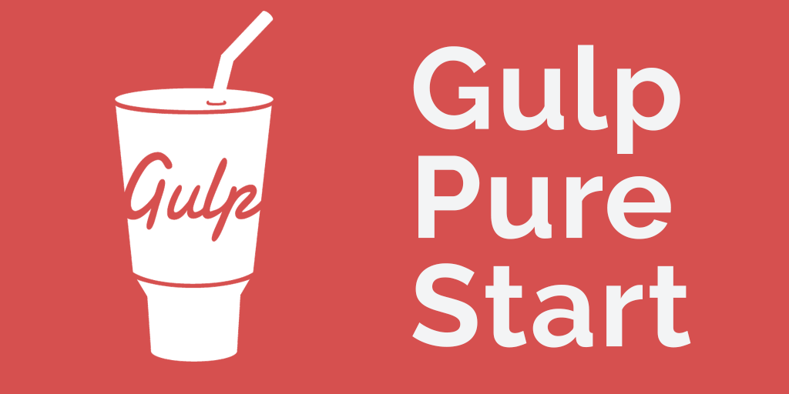
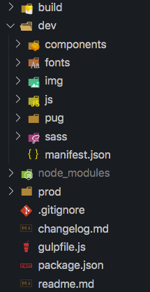
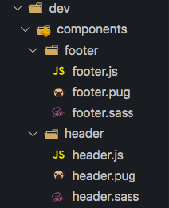
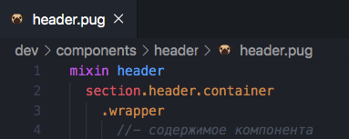
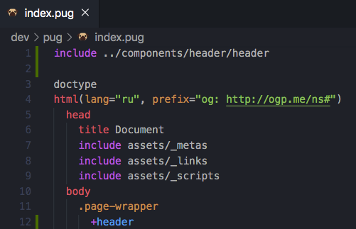
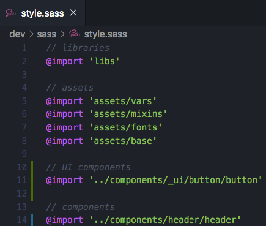
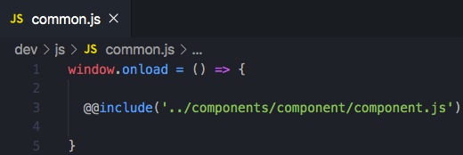

# Gulp Pure Start

v1.3.0

**Gulp Pure Start** позволяет легко и быстро начать работу над проектом с использованием сборщика Gulp.

Соответствуя основным потребностям в разработке веб-приложения GPS позволяет просто склонировать проект к себе, инициализировать и начать работать!

По желанию можно добавить свои плагины или не пользоваться всеми, которые есть в сборке. Весь код прокомментирован и по нему легко ориентироваться.

## Что может эта сборка
 + Работать с препроцессорами **SASS/PUG**
 + Запустить **локальный сервер** с возможностью просмотра сайта с разных устройств одной сети
 + Транспилировать **ES6** код в ES5
 + Минифицировать файлы
 + Генерировать критические стили
 + и многое другое...

## Как развернуть среду для проекта
 1. Скачиваем содержимое репозитория в папку проекта, команда — **`git clone https://github.com/nmihalyov/gulp-pure-start.git`** или скачиваем архив и в ручную распаковываем его
 2. В папке проекта в консоли выполняем команду **`yarn install`** (должен быть установлен [Node.JS](https://nodejs.org/en/) и [Yarn](https://yarnpkg.com/))
 3. Когда необходимые пакеты буду установлены (может потребоваться время), инициализируем настройку проекта (опционально) командой **`yarn init`**
 4. Рекомендуется сначала выполнить команду `gulp misc` для удаления лишних файлов
 5. Чтобы сразу начать отслеживание файлов и запустить локальный сервер выполните команду **`gulp`** (уже можно работать!)
 6. Для загрузки популярных библиотек/плагинов и т.п. воспользуйте командой **`yarn add название_пакета`**. Возможные пакеты можно найти [здесь](https://yarnpkg.com/en/packages). Все пакеты загружаются в папку *node_modules*. (Не забудьте добавить JS файлы через **libs.js**!)
 7. Для компиляции проекта в продакшен выполните команду **`gulp prod`**

## Готовые компоненты
В сброке присутствуют уже готовые стилизованые компоненты, а именно: кнопки, инпуты, чекбоксы, радио-кнопки и попапы. Их можно настроить под себя или удалить при необходимости.

Пример использования этих компонентов есть на странице *index.html*

## Структура

Стуктура проекта предельно проста:
 + В корневой папке:
   + **.gitignore** – запрещает отслеживание директорий/файлов Git'ом
   + **gulpfile.js** — скрипт настроек и тасков для Gulp'а
   + **package.json** — файл содержит информацию о проекте, авторе, а также список зависимостей
 + папка **dev** — рабочая папка, используемая во время непосредственно работы над проектом:
   + **manifest.json** — данные веб-приложения (подробнее: [здесь](https://developer.mozilla.org/ru/Add-ons/WebExtensions/manifest.json))
   + папка **components** — все компоненты проекта
   + папка **fonts** — шрифты
   + папка **img** — изображения
   + папка **js** — скрипты
   + папка **pug** — файлы Pug препроцессора
   + папка **sass** — файлы Sass препроцессора
 + папка **build** – папка, из которой запускается сервер, это рабочий билд
 + папка **prod** — папка готового проекта в продакшен, которая содержит минифицированные версии файлов и не содержит файлы типа **.sass/.pug**
 + папка **node_modules** — папка, содержащая зависимости проекта (появится после выполнения команды `yarn install`)

В **Gulp Pure Start**  предлагается использовать компонентный подход к разработке приложений. Это позволит без проблем переиспользовать блоки не только в рамках текущего проекта, но и даже в других проектах.

Выглядит это примерно так:

Подключение компонентов для каждой реализации:

**PUG**:

*Сам компонент является миксином*

*Подключение компонента-миксина*

**SASS**:

**JavaScript**:

## Быстрое создание компонентов
С помощью команды `yarn comp test` (или `npm run comp test`) создается директория *test* (может быть любая) в папке с компонентами и соответствующие файлы *pug*, *sass*, *js* (опционально).

Команда имеет три флага:
1. `--js` – дополнительно создает файл *js*
2. `--ui` – создает компонент в поддиректории *_ui*, что указывает на то, что компонент является базовым для UI
3. `--section` – создает компонент с базовой разметкой в виде секции с контейнером и оберткой (разметку можно поменять в файле *create-component.js* на любую другую)

Пример: `yarn comp hero about --js --section` – создаст в папке *dev/components/_ui* два компонета (*hero* и  *about*) с тремя файлами в каждом с базовой разметкой секции

## Рекомендации к использованию
Чтобы работа над проектом с **Gulp Pure Start** была легче и быстрее, рекомендуется придерживаться следующих правил:
1. Придерживайтесь изначальной структуры файлов/папок
2. **HTML** файлы по умолчанию компилируются в корень **build**, при необходимости можно изменить в  **gulpfile.js**: таск pug, строка **`.pipe(gulp.dest(${build}))`**
3. Все библиотеки устанавливаются в **node_modules**. Для их подключения используйте файл **js/libs.js** c директивой **@@include** (напр. **`@@include('../../node_modules/jquery/dist/jquery.js')`**), точно также можно импортировать несколько файлов JS в один результирующий для более удобной архитектуры (eсли вам надо подключить SASS/CSS, то подключайте их в **_libs.sass** (который нужно импортировать в style.sass или подключать библиотеки сразу в нём)
4. По-умолчанию из SASS-файлов компилируется только **style.sass**, остальные файлы стилей следует импротировать в него, или заменить строку таска **sass** **`return gulp.src('dev/sass/style.sass')`** на **`return gulp.src('dev/sass/*.sass')`**
5. В верстку стоит подключать **минифицированные файлы** — style.min.css/common.min.js/libs.min.js, т.к. именно **они попадают затем в билд!**
6. Существует шаблон Pug для более быстрого старта - **dev/pug/index.pug**
7. В папке **dev/pug/assets** находятся следующие вспомогательные файлы разметки: **_base.pug** – базовые стили для всего проекта, **_links.pug** – содержит все теги link для раздела head, **_metas.pug** – содержит все теги meta для раздела head, **_og.pug** – метатеги OpenGraph, **_scripts.pug** – подключение скриптов
8. В папке **dev/sass/assets** находятся следующие вспомогательные файлы стилей: **_base.sass** – базовые стили для всего проекта, **_fonts.sass** – подключение всех шрифтов, **_mixins.sass** – файл для миксинов, **_vars.sass** – глобальные переменные для стилей проекта

### [Патчноут](https://github.com/nmihalyov/gulp-pure-start/blob/master/changelog.md)

## Обратная связь
Почта: [nikita.mihalyov@gmail.com](mailto:nikita.mihalyov@gmail.com)

Telegram: [@nmihalyov](http://t.me/nmihalyov)

ВКонтакте: [vk.com](https://vk.com/nmihalyov)

[Написать issue](https://github.com/nmihalyov/gulp-pure-start/issues/new)